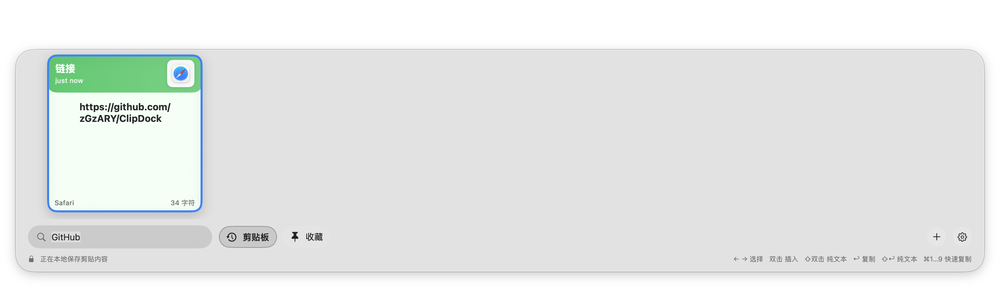
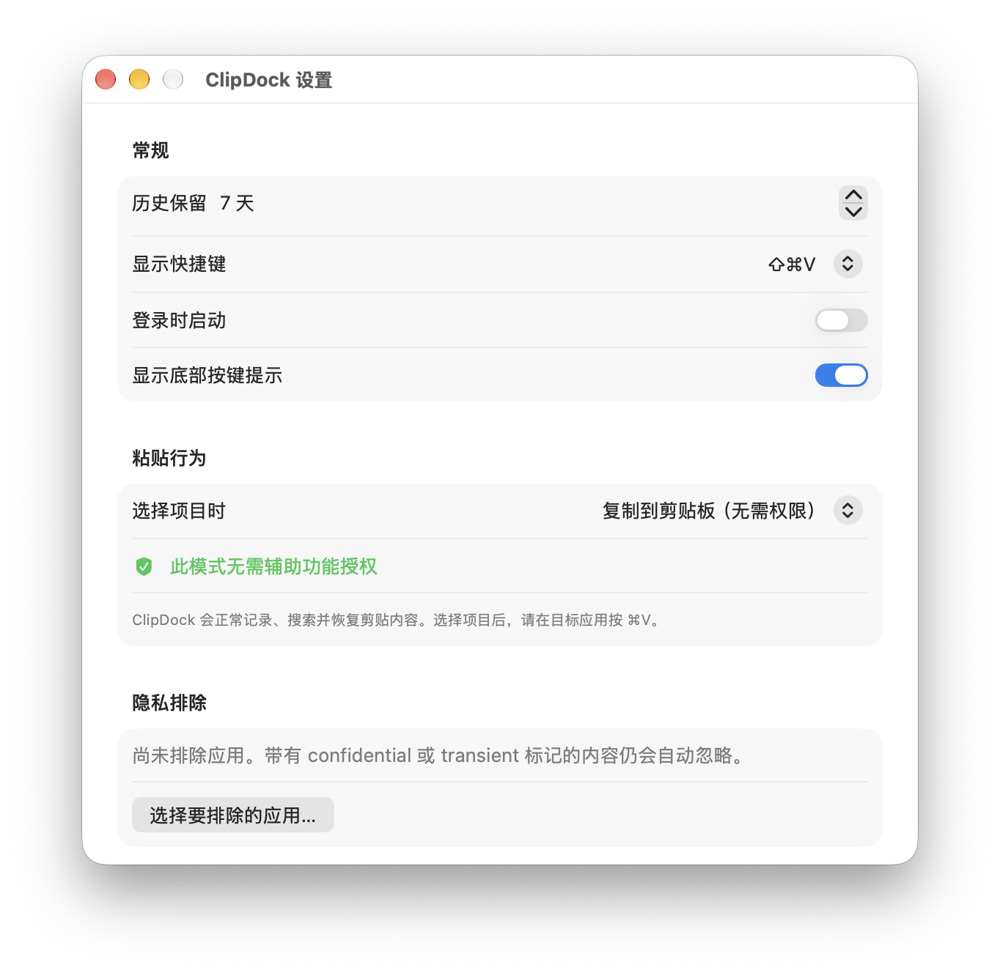

# Clipboard Ripple — Animated Clipboard Manager for macOS

[English](README.md) | [简体中文](README.zh-CN.md)

A native, local-first clipboard manager for macOS with Dock-style magnification.


## Highlights

- **Dock-style motion:** hover across the timeline and nearby cards smoothly grow, lift, and make room.
- **Fast recall:** search by content, source app, or type.
- **Simple actions:** click to select, double-click to paste, or use the keyboard.
- **Pinboards:** keep important clips close.
- **Native and lightweight:** built with SwiftUI, AppKit, SwiftData, and system frameworks only.

## More views

<p>
  
  
</p>

## Use

1. Copy text, links, images, files, or colors.
2. Press `⇧⌘V` to open Clipboard Ripple.
3. Choose a card, then press `Return` to copy it back or double-click to paste.

## Privacy

Clipboard history stays on your Mac. Clipboard Ripple has no network access, analytics, or cloud sync. You can exclude selected apps, and automatic paste is optional.

## Build

Clipboard Ripple requires macOS 14 or later.

```sh
xcodebuild -project ClipboardRipple.xcodeproj -scheme ClipboardRipple -configuration Debug build
xcodebuild -project ClipboardRipple.xcodeproj -scheme ClipboardRipple -configuration Debug test
```

For Release signing and local installation, see [SIGNING.md](SIGNING.md).

## License

Clipboard Ripple is licensed under the [GNU General Public License v3.0](LICENSE) (`GPL-3.0-only`).
